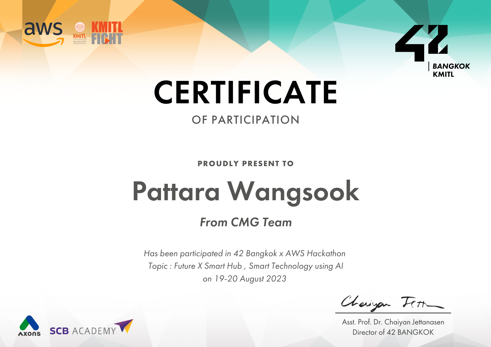

# Hi 👋, I'm Pattara Wangsook!  
### Currently: RAI King Mongkut's Institute of Technology Ladkrabang  

- 💬 Ask me about **godot**  
- 📫 How to reach me **pattara2546za@hotmail.com**  
- 👨‍💻 All of my projects are available at  **https://to-testone.github.io/**  
- ⚡ Fun fact **I love to develop games**  

<h3 align="left">Connect with me:</h3>

<h3 align="left">Experience:</h3>

<h3 align="left">Languages and Tools:</h3>

                   
